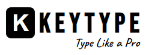
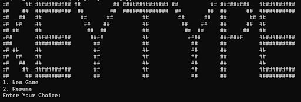
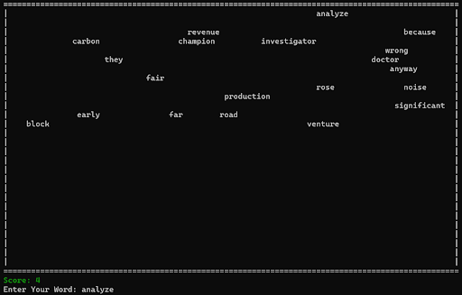
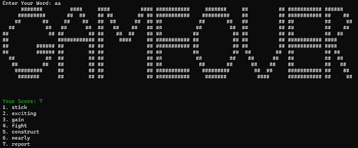

# Introduction
<p align="justify">KeyType is a console-based typing game where players type words that appear randomly on the board to score points. The game challenges your typing speed and accuracy as words gradually move down the board. It features a simple game loop, word management, and a pseudo-random number generator for word placement. The game also includes options to start a new game or resume a previous session, with the ability to save your progress and view your score.</p>

# Requirements
[Install JDK On Your Device](https://www.oracle.com/java/technologies/downloads/)
# How to Run
```shell
git clone https://github.com/masum184e/keytype.git
cd keytype
javac KeyType.java
java KeyType
```
# Preview
<video width="100%" height="240" controls>
  <source src="./preview.mp4" type="video/mp4">
</video>
# Objectives
<p align="justify">The primary objective of developing this word typing puzzle game is to provide players an entertaining and educational experience. It is a game that offers both enjoyment and opportunities for learning and skill development. Playing KeyType is a fun and engaging way to improve your typing speed and accuracy while challenging yourself under pressure. This fast-paced game requires you to type words quickly as they appear, testing both your reflexes and focus. With each word you type correctly, you’ll boost your score, develop better hand-eye coordination, and strengthen your muscle memory for faster, more accurate typing. Whether you're a student, professional, or simply looking to improve your skills, KeyType offers an enjoyable experience that turns learning into a game.</p>

# Stakeholders
- Computer Operator
- Programmer
- Student

# Features
- __Typing Practice with Random Words:__ Randomly generates words from a word bank for players to type, improving their typing speed and accuracy.

- __Dynamic Word Fall:__ Words fall from the top of the screen, and players must type them correctly before they reach the bottom to prevent a game over.

- __Scoring System:__ Players earn points for each word typed correctly, allowing them to track their progress and performance.

- __Resume Game Feature:__ Players can save their progress and resume from where they left off, maintaining continuity between game sessions.

- __Time-Interval Word Generation:__ New words appear at set intervals, with the speed increasing as the game progresses, making it more challenging.

- __Game Over Screen with Final Score:__ Displays a game over screen when words reach the bottom, along with the player's final score.

- __Word Removal on Correct Typing:__ Words disappear from the board as soon as they are typed correctly, making room for new words.

# Challenges
- __Game Logic and Mechanics:__ Designing the core game logic, including word generation, word matching, word falling, and user interactions, can be complex. Ensuring that the game is both enjoyable and challenging is a significant challenge.

- __Word Management:__ Handling a large word database efficiently and randomizing word selection can be tricky, especially to provide a variety of words for players.

- __Game State Management:__ Implementing features like game saving, resuming, and tracking player progress can be complex and require careful management of game states and data.

- __Timing:__ Achieving smooth and realistic word falling with precise timing can be challenging.

- __User Interface:__ Console games lack the graphical user interface, so you need to design and implement the game's user interface in the console. This can be challenging as you need to display information, game menus, and game states in a way that is easy to understand.

# User Interface
## Game Start
This interface defines methods or behaviors related to starting the game. It includes methods for initializing the game, presenting a game menu, and handling user choices at the beginning of the game.


## Game Board
This interface defines methods or behaviors related to the game’s current state. It includes methods for initializing the game board, updating the display as the game progresses, and handling user interactions with the game board.


## Game Over
This interface likely defines methods or behaviors related to the game over state. It includes methods for displaying a game over message, calculating and presenting the player's score, and handling actions after the game has ended.


# OOP Concepts
## Classes and Objects
The code defines several classes, such as BoardManager, FileManager, PseudoRandomNumber, Word, and WordIndex. Objects of these classes are created and used to encapsulate data and behavior.
## Encapsulation
Encapsulation is demonstrated by the use of classes and methods to group related data and functions together. For example, the Word class encapsulates word-related functions like word matching and word generation.

# Programming Concepts
- __File I/O:__ The code uses Java's File I/O concepts to read and write data to files. It employs classes like BufferedReader and BufferedWriter for reading and writing data efficiently.

- __Data Structures:__ Arrays are used to represent the game board and manage word data. For example, a 2D character array boardBox represents the game board.

- __Looping:__ The code utilizes nested for loops for various purposes, such as iterating through the game board to display it or performing operations on lists of objects.

- __Conditional Statements:__ Conditional if-else statements are used to make decisions within the code, such as determining the state of the game or checking user input.

- __Random Number Generation:__ Random number generation is employed to select random words from a list and determine various game elements, such as word positions and falling speeds.

- __Timer and Multithreading:__ The code utilizes Java's Timer class for scheduling periodic events, such as adding new words to the game board. This involves concepts related to multithreading and task scheduling.

- __User Input Handling:__ The Scanner class is used to handle user input, allowing players to interact with the game by entering words.

- __String Manipulation:__ Various string manipulation operations are performed, such as splitting strings and checking for equality.

- __Clearing the Console:__ Code for clearing the console screen (_\033[H\033]2J_) is used to provide a clean display.

# Class Uses
## BoardManager
It manages the game board, including its initialization, display, and updating. It is responsible for setting up the game board, displaying the board, managing game states, and handling game over conditions.
## FileManager
It handles file input and output operations, including reading 
and writing word lists and game progress data. It is responsible for reading word lists, saving and loading game progress, checking file sizes, and managing correct word lists.
## PseudoRandomNumber
It generates pseudo-random numbers based on a seed value for various game elements. It is responsible for generating random numbers for word selection, word positions, and game mechanics.
## WordManager
It represents a word on the game board with its content and position. It is responsible for storing word data (content and position) and providing a structured representation for words on the board.
## Word
It manages word-related operations within the game, such as word generation, matching, and falling. It is responsible for generating random words, checking word matching, handling word falling, and updating the game state.

# Files
## `wordData.txt`
This text file serves as a database of words that can be used in the game. It contains a list of words from which random words are selected for gameplay. Words in this file are read and loaded into the game to provide a pool of options for word generation.

## `resume.txt`
The resume.txt file is used for saving and resuming game progress. When the player chooses to save their game, the positions of words on the game board are recorded in this file. Later, when the player chooses to resume their game, the positions are read from this file to restore the game's state to where it was saved.

## `correctWord.txt`
This text file is used to record words that the player has correctly typed during gameplay. It serves as a log of the player's achievements, keeping track of the words they successfully entered. The contents of this file can be displayed to the player to show their progress.
